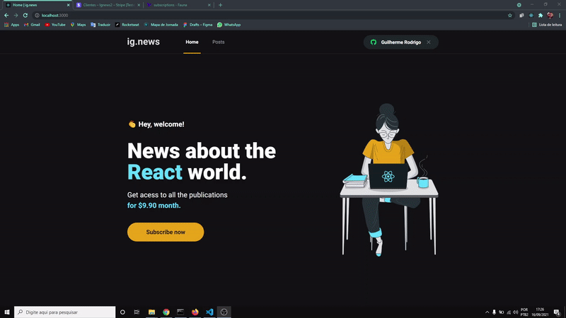
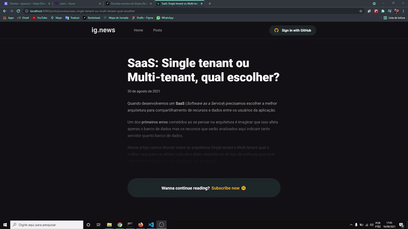
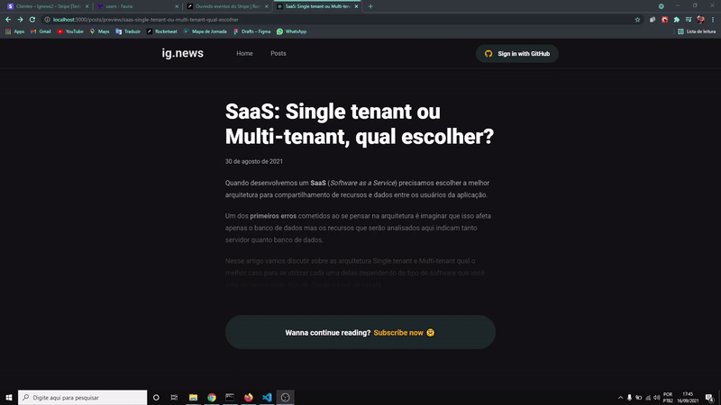
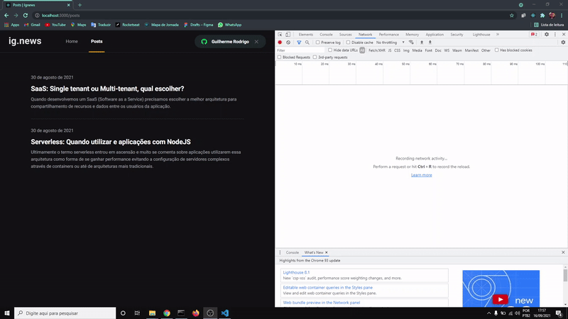

# Ig.news

A aplicação ***Ignews*** foi desenvolvida com parceria da ***RocketSeat*** utilizando o framework **Next.js**, adotando a estratégia de renderização em **"SSG"** para obter maior performance. Consiste em uma página no estilo blog, listando posts que são consumidos do **Prismic CMS.**. Porém para o usuário poder consumir este conteúdo, o mesmo deverá estar autenticado com o **GitHub** e com inscrição ativa no **Stripe**, **API** para pagamentos via cartão.

As informações do usuários são salvas no banco **FaunaDB**. Este é um banco de dados NoSQL, otimizado para aplicações ***serverless***, que é um modelo de desenvolvimento nativo em nuvem para criação e execução de aplicações sem o gerenciamento de servidores(back-end) como o ***Ignews***

## Importante

A grande vantagem de utilizar SSG no Next.js é que a página ja é gerada de forma estática no momento do build da aplicação, assim quando acessada, a página já está pronta pra ser exibida no browser.

O benefício de adotar esta estratégia é que a página por ja estar com o seu "core" pronto, ela é indexada em primeiras colocações por motores de busca como **Google, Bing, etc ...**

Então páginas construídas desta forma, possuem grande performance, em outras palavras, carregam mais rápido pelo browser e aparecem primeiro em buscas, tornando sua visibilidade maior.

Um exemplo prático disto seria um **e-commerce**, a página do ***Magazine Luiza*** utiliza ***Next*** com ***SSG***, automaticamente se a visibilidade é maior, os acessos também são maiores e conversão dos acessos em vendas cresce exponencialmente.

## Tecnlogias

  - React
  - Next.js
  - FaunaDB
  - Prismic CMS
  - Stripe
  - Typescript
  - SASS ( CSS )
  - Date-fns

## Funcionamento

### Autenticação com GitHub

  

### Comprando via cartão com Stripe

Através dos eventos recebidos via **api** do **Stripe**, o **Ignews** identifica que a compra foi bem sucedida e redireciona o usuário para a página de posts, podendo agora consumir o conteúdo exclusivo.

  

### Sessão do usuário (GitHub)

A sessão do usuário fica salva no browser, sem a necessidade de acessar o modal de login do Github novamente. No canto superior direito, o ícone fica na cor verde seguido do nome do usuário, indicando que a sessão está ativa. Após a aplicação segue seu fluxo normal.

### SSR (server-side rendering)

As páginas que não são construídas usando **SSG**, utilizam a estratégia de renderização ***SSR***, basicamente quando os motores de busca quando vão indexar as páginas web, eles não esperam por exemplo que uma chamada api seja concluída, pois o servidor que responderá essa chamada pode estar com lentidão. Com o processo de ***SSR*** (server-side rendering) nós conseguimos fazer com que o NodeJS faça a renderização do nosso componente antes da resposta ao cliente chegar, ou seja, todo conteúdo necessário para o componente ser exibido em tela chega pronto ao front-end, tornando a aplicação performática e melhor indexada como citado acima.

  

### Preview do conteúdo exclusivo

Caso o cliente não possua uma assinatura do ***Ignews*** ele acessa um página com uma prévia do conteúdo, se o mesmo se interessar e quiser realizar uma assinatura a página o redireciona para a "home" através de um botão na parte inferior, ou se um usuário que ja possui assinatura ativa acessar por ventura uma página "preview", ao realizar a autenticação, o conteúdo é liberado automaticamente.

  

  

## Performance

Através das ferramentas de desenvolvedores do browser é possível verificar que usando ***Next.js*** o carregamento não é refeito sem necessidade. O resultado disso é que o cliente acessa a página muito mais rápido.

  

